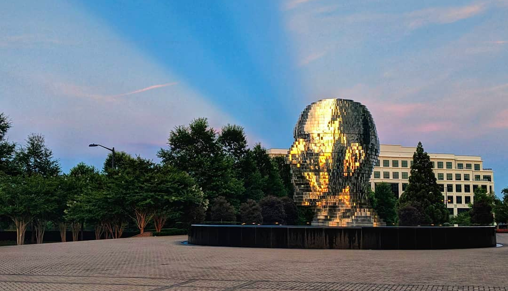

import { NewsletterSignup } from '../../components/NewsletterSignup/';

I'm Mike Bifulco. I'm a technologist, a designer, and a creator of things. I started this as a place to put together my thoughts on things that I think deserve a bigger voice than twitter or GitHub.

My beliefs are always changing - but here's some things that are important to me:

- I believe in the power of critical thought, and the scientific process.
- I believe all people deserve fair and equitable access to all things. 🏳️‍🌈
- I know that my knowledge is imperfect, and I can be blind to my privilege. I'm always willing to listen.
- There is opportunity for design and technology to impact and benefit all facets of our life.
- Humor is a good thing. Let it in. _Let it in!_

I'd love to hear your thoughts on my thoughts - don't be shy!

<NewsletterSignup hideStripe />
