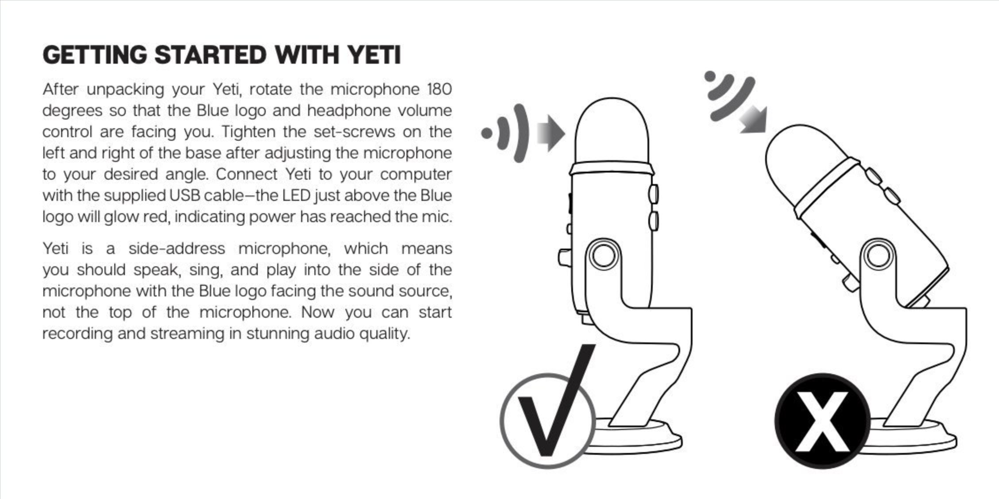
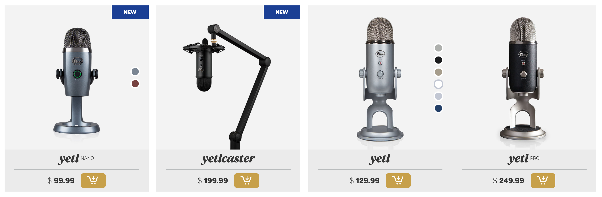
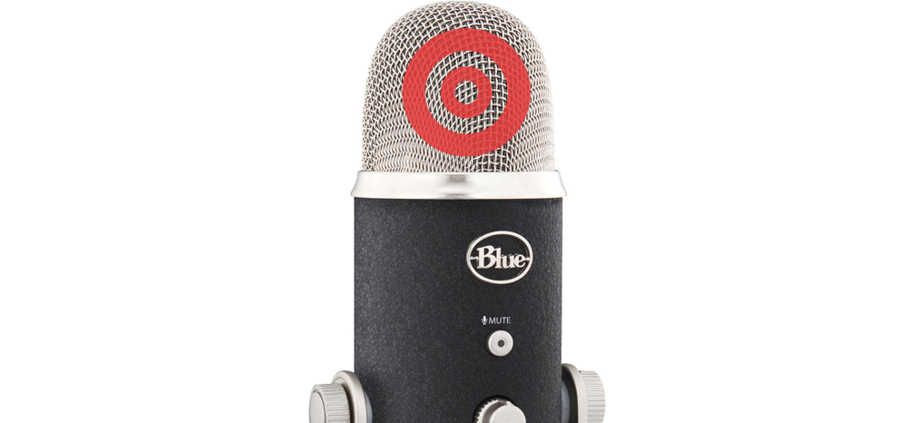

It's one of those things. Once you see it, you absolutely cannot _un-see_ it. I apologize if I'm doing this to you, but it bugs me, and I want it to bug you, too.

## Enter the yeti

If you're a hobbyist podcaster, you've almost certainly come across recommendations for the [blue yeti](https://www.bluedesigns.com/products/yeti/) microphone. For about a hundred bucks, you get a decent quality condenser microphone that will plug into your computer via USB. Frankly, for the _vast_ majority of people getting into podcasting, it'll be more than you ever need, particularly if you use it correctly.

Funny enough, there is one other yelly-screamy article about [if you're going to use a blue yeti, please use it right ](http://bestpodcastinggear.com/if-youre-going-to-use-a-blue-yeti-please-use-it-right/), but even that diatribe doesn't cover what I'm so peeved about. The Yeti has a problem - its audience is casual enough not to be expert on high end microphones, and they're not incentivized to learn about their new device.

Check this out:

<em>Excerpt from the user manual on [Blue's website](https://www.bluedesigns.com/pdf/manuals/yeti/Blue_Yeti_QuickStartGuide-EN.pdf).</em>

Most peoples' exposures to microphones are limited to weddings and bar mitzvahs, and the occasional rock concert or other public event. They're used to seeing folks using a handheld mic, and speaking into the top of it -

<em>Photo of a performer singing into a handheld microphone by [Ana Paes](https://unsplash.com/photos/ieFTeJUgubw?utm_source=unsplash&utm_medium=referral&utm_content=creditCopyText) on [Unsplash](https://unsplash.com/search/photos/blue-yeti?utm_source=unsplash&utm_medium=referral&utm_content=creditCopyText).</em>

If you take apart a Yeti, underneath that chic metal-grate dome, you'll actually find 3 microphone capsules - none of them pointed upwards. There is no combination of settings on the Yeti that will yield great audio if you're speaking into the top of the device.

If you ask me (and you do), this isn't user error. The physical design of these types of microphones is ambiguous enough that their proper use isn't apparent. Folks who buy a Yeti are generally only exposed to microphones with a drastically different form factor - how are they supposed to know better?

## What to do about it

At some level, as long as they're selling like gangbusters, there's nothing that should motivate Blue to ever change the sleek design of their Yeti. In fact, they've expanded their Yeti lineup since its inception. You'll notice this design challenge is now present across a good few of [Blue's microphones](https://www.bluedesigns.com/):

_A few of Blue's microphones from their website - all of which have the same design challenge_

If, hypothetically, Blue wanted to improve on this design to ensure that users of their mic had the best possible recording results, what could they do? Since they already include a whole-page sized warning in the bundled instruction manual for the product, I think the next best step is to physically change the product. Something as simple as a graphic silkscreened onto the mesh dome might do the trick:

## Footnote

I should add that I don't mean to target Blue specifically. This isn't just about their microphone. This happens with any number of other mics from other companies with similar design. The Yeti just happens to be the most popular. In fact, I have one, and I use one - and it's great! Maybe that's why this burns me up so much.
